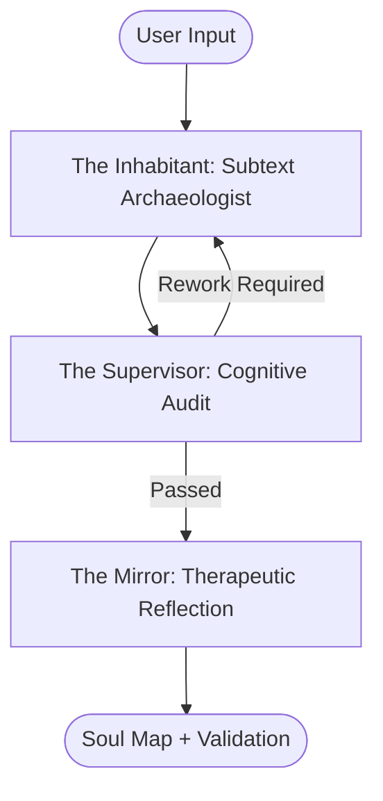

# 💎 Prism Emotional Engine v1.1
### Shadow-Aware Affective Computing & 3D Topographical Mapping

**Prism** is an advanced emotional diagnostics framework designed to identify the discrepancy between a user's literal narrative and their latent psychological state. By utilizing **Topographical Affective Mapping**, Prism transforms complex 11-dimensional emotional vectors into intuitive 3D "Soul Map" landscapes.

---

## 🚀 The Master Architecture: Agentic LangGraph Pipeline
Prism v1.1 implements a state-of-the-art **Agentic Consortium** using LangGraph to perform a multi-layered emotional audit:



### 1. 🕵️ The Inhabitant (Subtext Archaeologist)
Analyzes the deep subtext, word choice, and pacing to generate the **Shadow Sentence**—the unspoken truth beneath the surface. It classification includes emotional "Viscosity" (Stuck, Flowing, or Breakthrough).

### 2. ⚖️ The Supervisor (Cognitive Audit Engine)
Cross-validates inferences against the **User's Historical Baseline** and the **Personality Constitution**. It assigns a **Dissonance Score** and calculates a **Trust Weight** using a Sigmoid-based Bayesian update model.

### 3. 🪞 The Mirror (Therapeutic Reflection)
Uses the shadow meaning to adjust its own tone without explicitly diagnosing or confronting the user. It follows principles of **Motivational Interviewing** to avoid triggering psychological reactance.

---

## 🌟 Key Features

*   **📖 Multiline Diary Mode:** Support for long-form journal entries. Paste entire paragraphs and submit with a double-enter.
*   **📜 Personality Constitution:** A learning system that records explicit user corrections and passive observations to build a unique behavioral model over time.
*   **📈 EMA Baselines:** Calculates an Exponential Moving Average (EMA) of your emotional trajectory, weighting recent entries by their "Trust Score."
*   **🛡️ Shadow-Aware Diagnostics:** Detects "Adversarial Defenses" and "Masking" (the distance between literal and latent states).

---

## 📊 Interpreting the Soul Map
The 3D visualization (built with Matplotlib) acts as a structural integrity report:

*   **Gaussian Peak (Z-Axis):** Represents Valence Amplitude. A high peak indicates reported positivity. 
*   **Surface Tension (Noise):** Calculated as `(1.0 - Agency)`. 
    *   **Smooth Surfaces:** Indicate high agency and structural resonance.
    *   **Jagged Spikes:** Indicate internal chaos, low agency, and emotional noise.
*   **Color Mapping:** 
    *   `Magma` (Warm): **Resonance.** The peak matches the underlying heat.
    *   `Ocean` (Cold): **Dissonance.** The peak is a "mirage" lacking a solid base.

---

## 🛠️ Installation & Setup

### 1. Clone & Install Dependencies
Ensure you have Python 3.10+ installed.
```bash
git clone https://github.com/ayushGarg2404/Prism-Emotional-Engine.git
cd Prism-Emotional-Engine
pip install -r requirements.txt
```

### 2. Configuration
Create a `.env` file in the root directory and add your Google Gemini API Key:
```env
GOOGLE_API_KEY=your_actual_api_key_here
```

### 3. Execution
```bash
python src/prism_main.py
```

---

## 📂 Project Structure
*   `src/prism_main.py`: Entry point; handles multiline input and reporting.
*   `src/prism_graph.py`: The LangGraph agentic orchestration logic.
*   `src/prism_memory.py`: Database handling for `prism_vault.json` and the Constitution.
*   `src/prism_interpreter.py`: Structural topography analysis and color logic.
*   `src/prism_visualizer.py`: 3D Matplotlib engine for Soul Map rendering.

---
*Created by ayushGarg2404 — Bridging the gap between linguistic semantics and psychological subtext.*
